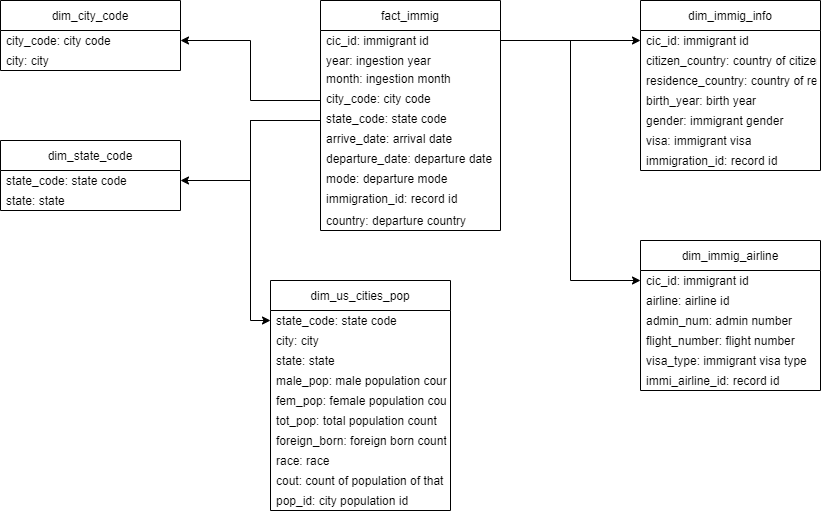

# Udacity Data Engineer Nanodegree - Capstone Project

### Data Engineering Capstone Project

#### Project Summary
This project aims to solve questions utilizing US immigration data, city demographics and airport codes. Spark was used to develop the ETL pipeline and store the results in parquet for downstream analysis. It pull down data from 3 different sources: I94 Immigration, US City Demographic Data and an Airport Code Table. The finall product is one fact table (`fact_immig`) and six dimension tables (`dim_immig_info`, `dim_immig_airline`, `dim_country_code`, `dim_city_code`, `dim_state_code` and `dim_us_cities_pop`).

#### Scope

The goal of this project is to pull data from 3 different sources and then create fact and multiple dimension tables to be able to analyze the US immigration factors utilizing the city demographics and airports. Some examples of analysis:
* Differences between quantities of travelers that fly to cities with generally more immigrants.
* Statistics of which country come most travelers and the percentages of gender that travel from each country.
* Statistics of the most immigrant colluded airports in the US.

#### Describe and Gather Data
1. I94 Immigration Data:  This data comes from the US National Tourism and Trade Office, it contains information on international travelers to the US.
1. US City Demographic Data: It contains information about the demographics of all US cities such as average age, male and female population.
1. Airport Code Table: This is a simple table of airport codes and corresponding cities

#### Conceptual Data Model

#### Staging Table
`staging_immig`
 * **cicid**: double (nullable = true)
 * **i94yr**: double (nullable = true)
 * **i94mon**: double (nullable = true)
 * **i94cit**: double (nullable = true)
 * **i94res**: double (nullable = true)
 * **i94port**: string (nullable = true)
 * **arrdate**: double (nullable = true)
 * **i94mode**: double (nullable = true)
 * **i94addr**: string (nullable = true)
 * **depdate**: double (nullable = true)
 * **i94bir**: double (nullable = true)
 * **i94visa**: double (nullable = true)
 * **count**: double (nullable = true)
 * **dtadfile**: string (nullable = true)
 * **visapost**: string (nullable = true)
 * **occup**: string (nullable = true)
 * **entdepa**: string (nullable = true)
 * **entdepd**: string (nullable = true)
 * **entdepu**: string (nullable = true)
 * **matflag**: string (nullable = true)
 * **biryear**: double (nullable = true)
 * **dtaddto**: string (nullable = true)
 * **gender**: string (nullable = true)
 * **insnum**: string (nullable = true)
 * **airline**: string (nullable = true)
 * **admnum**: double (nullable = true)
 * **fltno**: string (nullable = true)
 * **visatype**: string (nullable = true)
 
#### Fact Table
`fact_immig`
 * **cic_id**: double (nullable = true)
 * **year**: double (nullable = true)
 * **month**: double (nullable = true)
 * **city_code**: string (nullable = true)
 * **state_code**: string (nullable = true)
 * **arrive_date**: date (nullable = true)
 * **departure_date**: date (nullable = true)
 * **mode**: double (nullable = true)
 * **immigration_id**: long (nullable = false)
 * **country**: string (nullable = false)

#### Dimensional Tables
`dim_immig_info`
 * **cic_id**: double (nullable = true)
 * **citizen_country**: double (nullable = true)
 * **residence_country**: double (nullable = true)
 * **birth_year**: double (nullable = true)
 * **gender**: string (nullable = true)
 * **visa**: double (nullable = true)
 * **immigration_id**: long (nullable = false)

`dim_immig_airline`
 * **cic_id**: double (nullable = true)
 * **airline**: string (nullable = true)
 * **admin_num**: double (nullable = true)
 * **flight_number**: string (nullable = true)
 * **visa_type**: string (nullable = true)
 * **immi_airline_id**: long (nullable = false)

`dim_country_code`
 * **country_code**: string (nullable = true)
 * **country**: string (nullable = true)

`dim_city_code`
 * **city_code**: string (nullable = true)
 * **city**: string (nullable = true)

`dim_state_code`
 * **state_code**: string (nullable = true)
 * **state**: string (nullable = true)

`dim_us_cities_pop`
 * **state_code**: string (nullable = true)
 * **city**: string (nullable = true)
 * **state**: string (nullable = true)
 * **male_pop**: string (nullable = true)
 * **fem_pop**: string (nullable = true)
 * **tot_pop**: string (nullable = true)
 * **foreign_born**: string (nullable = true)
 * **race**: string (nullable = true)
 * **cout**: string (nullable = true)
 * **pop_id**: long (nullable = false)
 
 #### Data Pipeline
Steps necessary to pipeline the data into the chosen data model

1. Load the information for the staging table `staging_immig`
1. Clean the data: Delete duplicate, cleanse nulls, change data types, etc.
1. Create fact table `fact_immig`.
1. Create dimension tables for `dim_immig_info`, `dim_immig_airline`, `dim_country_code`, `dim_city_code`, `dim_state_code` and `dim_us_cities_pop`.
1. Save processed fact and dimension tables as parquet.

#### Data dictionary

##### Fact Table
`fact_immig`
 * **cic_id**: immigrant id
 * **year**: ingestion year
 * **month**: ingestion month
 * **city_code**: city code
 * **state_code**: state code
 * **arrive_date**: arrival date
 * **departure_date**: departure date
 * **mode**: departure mode
 * **immigration_id**: record id
 * **country**: departure country

##### Dimensional Tables
`dim_immig_info`
 * **cic_id**: immigrant id
 * **citizen_country**: country of citizenship
 * **residence_country**: country of residence
 * **birth_year**: birth year
 * **gender**: immigrant gender
 * **visa**: immigrant visa
 * **immigration_id**: record id

`dim_immig_airline`
 * **cic_id**: immigrant id
 * **airline**: airline id
 * **admin_num**: admin number
 * **flight_number**: flight number
 * **visa_type**: immigrant visa type
 * **immi_airline_id**: record id

`dim_country_code`
 * **country_code**: country code
 * **country**: country

`dim_city_code`
 * **city_code**: city code
 * **city**: city

`dim_state_code`
 * **state_code**: state code
 * **state**: state

`dim_us_cities_pop`
 * **state_code**: state code
 * **city**: city
 * **state**: state
 * **male_pop**: male population count
 * **fem_pop**: female population count
 * **tot_pop**: total population count
 * **foreign_born**: foreign born count
 * **race**: race
 * **cout**: count of population of that race
 * **pop_id**: city population id
 
 * *Choice of tools and technologies for the project*
    * As the I94 US Immigration Data needed a large amount of processing power, that's why Spark is used. It helped to scale and read files such as SAS, Parquet, and CSV. Integrates AWS S3 bucket to save the data.
    * Star schema was used because the objective is to make simplified queries that require fast aggregations such as finding the most immigrant colluded airports in the US. The tables are connected in a way that is easier to find a general table for each topic.
* *Update periodicity*
    * The staging information updates every month, as it is the main source of information the tables should be updated when that data becomes available. 
* *Scenarios*:
     * The data was increased by 100x.
        * If the data was increased by 100x, Pyspark locally begins to lac computational power. Creating a cluster in AWS should be considered, it would process all the staging information in S3 and then create the fact and dimensional tables.
     * The data populates a dashboard that must be updated on a daily basis by 7am every day.
        * If the data populates a dashboard that must be updated daily at 7am every day, Airflow is a great solution to schedule and automate a data pipeline that 
needs specific timelines. Utilizing the built-in retry and monitoring mechanisms it will be possible to check if there's an error in the process.

     * The database needed to be accessed by 100+ people
        * If the database needed to be accessed by 100+ people, a Data Warehouse in a cloud such as AWS is the best solution. It can help manage the user's workload, computational resources and ensure that every user has defined access depending on their role.